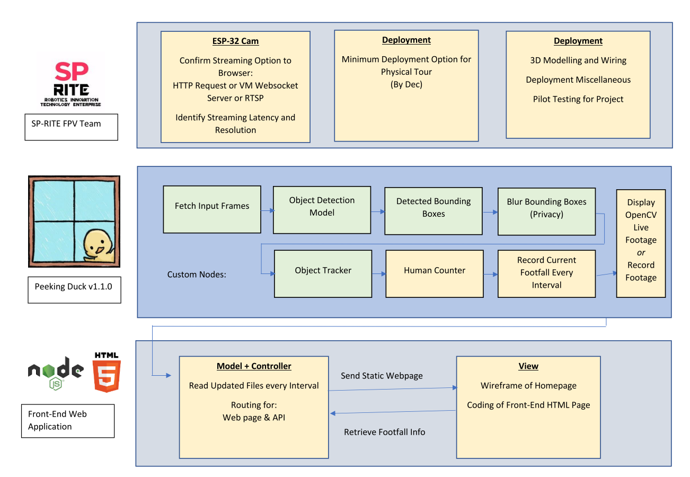

# Human Entrance Counter with PeekingDuck
Human Entrance Counter is a jointly-collaborated project between [SPAI](https://www.instagram.com/spai.sp/) and [SP-RITE](https://www.instagram.com/sp.riteclub/) and its aim is to detect the amount of human traffic moving in and out of a bounded region at any given time.

## Project Overview

The project utilizes [PeekingDuck](https://github.com/aimakerspace/PeekingDuck) with custom nodes for human detection and tracking along with [Express.js](https://expressjs.com/) as backend controller.




## To-Do
### PeekingDuck Model
- [x] Implement Centroid Tracking Custom Nodes
- [ ] Implement Drawing Centroid with Id Custom Nodes
- [ ] Count Objects Based on Centroid Movement Custom Nodes
- [ ] Logging of Total Individual Custom Nodes
- [ ] Integration of Python Scripts / Peekingduck CLI with Web Application

### Front-End Web Application
- [ ] Design Wireframe for Front-End
    - Display current footfall
    - Display past statistics
    - Display camera location
    - More Features...
- [ ] Development of HTML Pages

### Back-End Web Application
- [ ] Read in footfall information
- [ ] Design and Implement Routing
    - homepage
    - footfall api
    - More Features...


## Software Required:
- [Anaconda](https://www.anaconda.com/products/individual)
- [git](https://git-scm.com/downloads)
- [GitHub Desktop (For those that are unfamiliar with CLI)](https://desktop.github.com/)
- [VS Code](https://code.visualstudio.com/)

## Getting Started
1. Clone the Repository by 
    - Using Git CLI
        ```
        git clone https://github.com/SPAI-Team/Human-Entrance-Counter.git
        ```
    - Use GitHub Desktop App
        - Add repository
        - Clone repository
        - Input the URL `SPAI-Team/Human-Entrance-Counter`
2. Setting Up Conda Python Environment
    ```bash
    conda create --name human-entrance python=3.8
    conda activate human-entrance
    pip install peekingduck
    ```